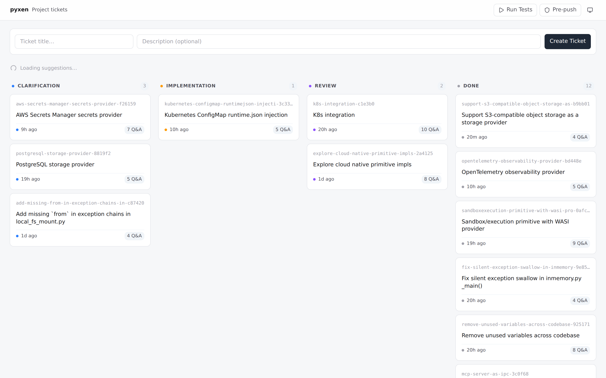
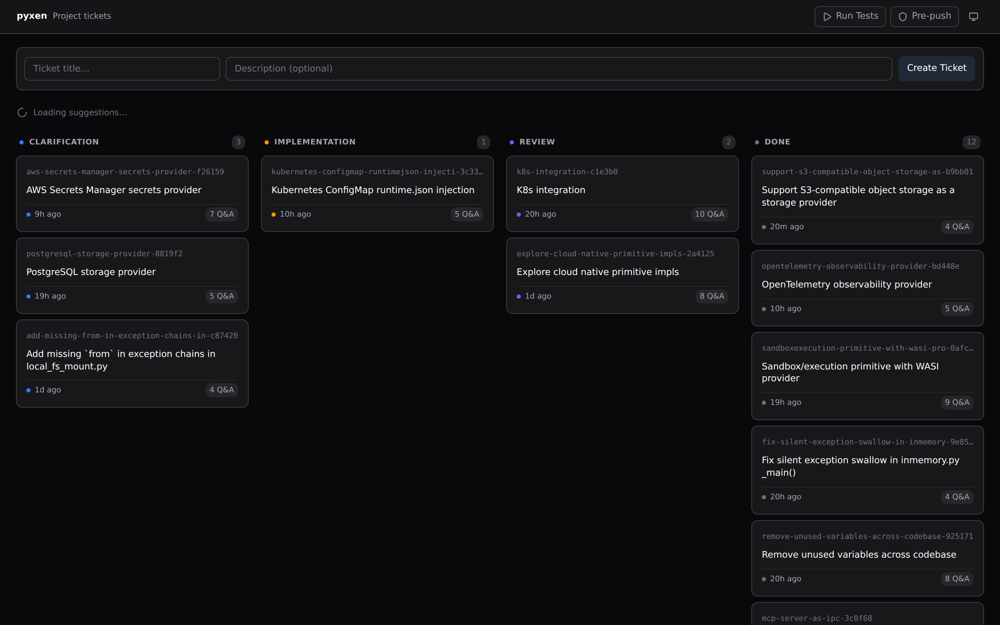
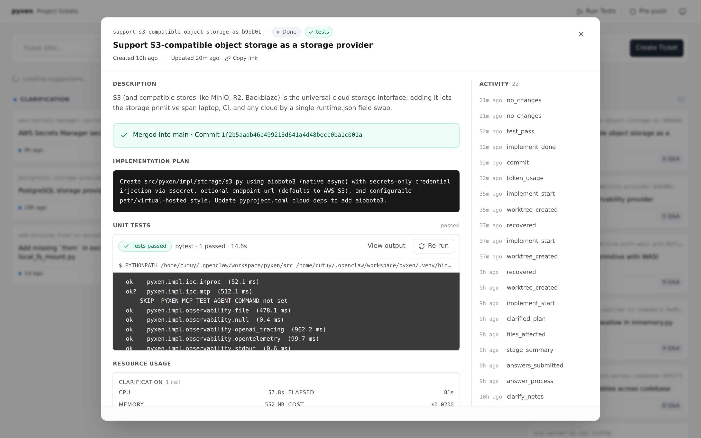
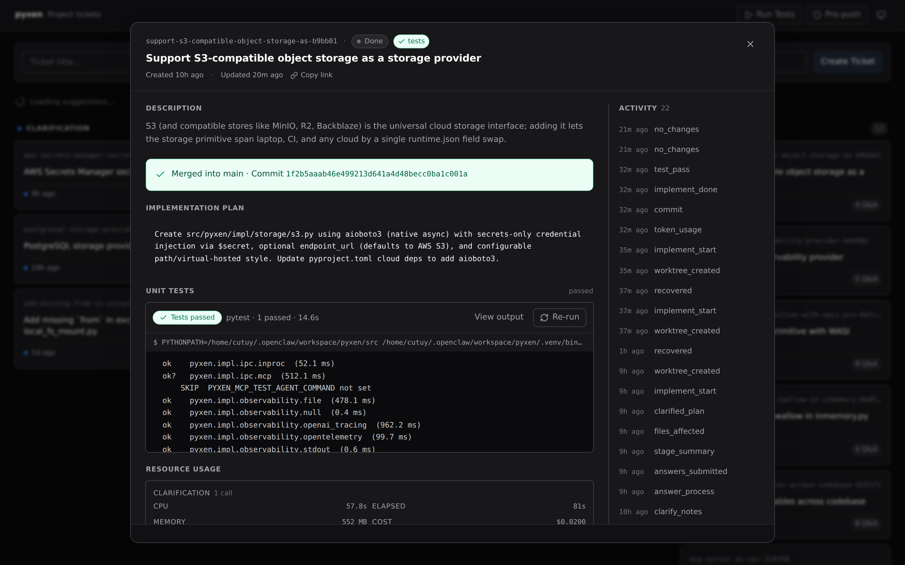
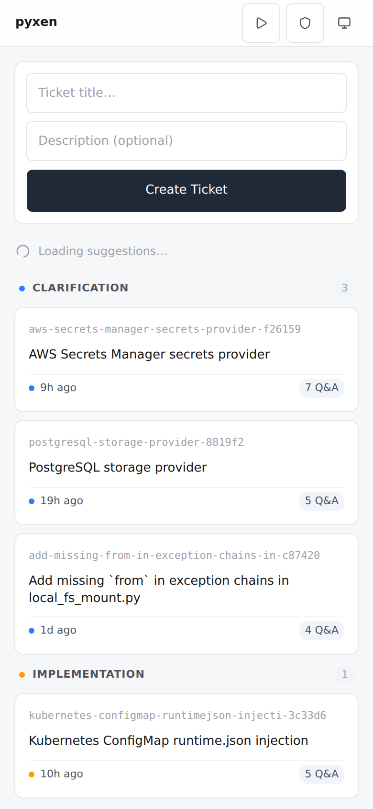
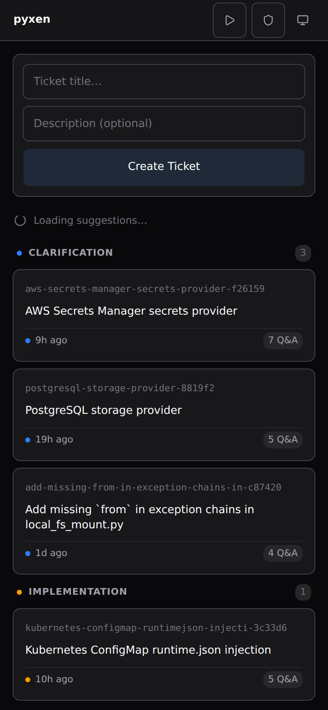

# Jira Dashboard

Lightweight ticket dashboard for AI-assisted development. No DB servers, no cloud accounts.

## Screenshots

### Board (Desktop)

The four-stage board (Clarification → Implementation → Review → Done) with AI-suggested tickets above. Theme follows system preference; toggle to dark with the moon icon.





### Ticket Detail (Desktop)

Click any card to open the full ticket popup: description, implementation plan, unit-test results with collapsible output, per-stage resource usage (CPU / memory / cost / tokens), and the activity timeline on the right.





### Mobile

Single-column layout, full-screen sheet for ticket detail. Touch-friendly button sizes (44px tap targets), collapsible activity log, same data, no compromises.

<p align="center">
  
  
</p>

<p align="center">
  
</p>

## Quick Start

```bash
git clone <this-repo>
cd jira-dashboard
./bootstrap.sh   # interactive — prompts for project path, coder CLI, etc.
```

Opens http://localhost:3006.

## Configuration

| Where | What | Tracked |
|---|---|---|
| `<project>/.jira-dashboard/.env` | Dashboard settings (port, project name, coder bin) | No (`.gitignore` has `*`) |
| `<project>/.env` | Environment for the coder subprocess (API keys, venv) | Usually not |
| `config.json` | Structural defaults (timeouts) | Yes |

### How config loading works

1. Walks up from `cwd` looking for `.jira-dashboard/.env` → that directory becomes `projectDir`
2. Loads `.jira-dashboard/.env` as dashboard settings
3. Loads `<project>/.env` and injects into `process.env` — coder CLI inherits these
4. `config.json` values are fallbacks for everything

## Caveats

- **API keys** go in `<project>/.env` (not `.jira-dashboard/.env`). Only the project root `.env` is passed to the coder child process.
- **Linux only** — resource monitor reads `/proc/<pid>/stat`.
- **Python venv** — `VIRTUAL_ENV` and `.venv/bin/` are prepended automatically.

---

## For Maintainers

```bash
npm test            # run all tests
npm run test:config # config loader only
```

### Pre-push hook

```bash
git config core.hooksPath .githooks
```
