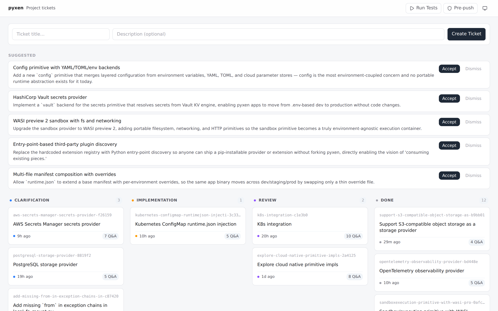
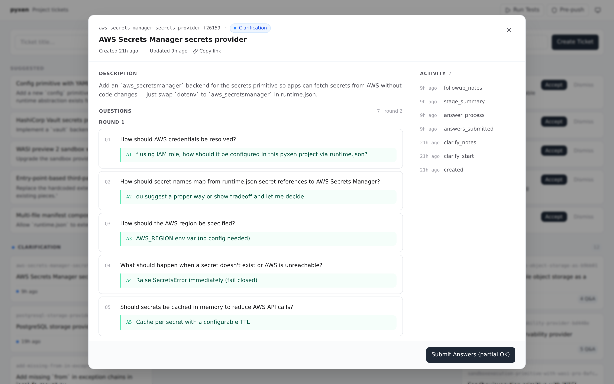
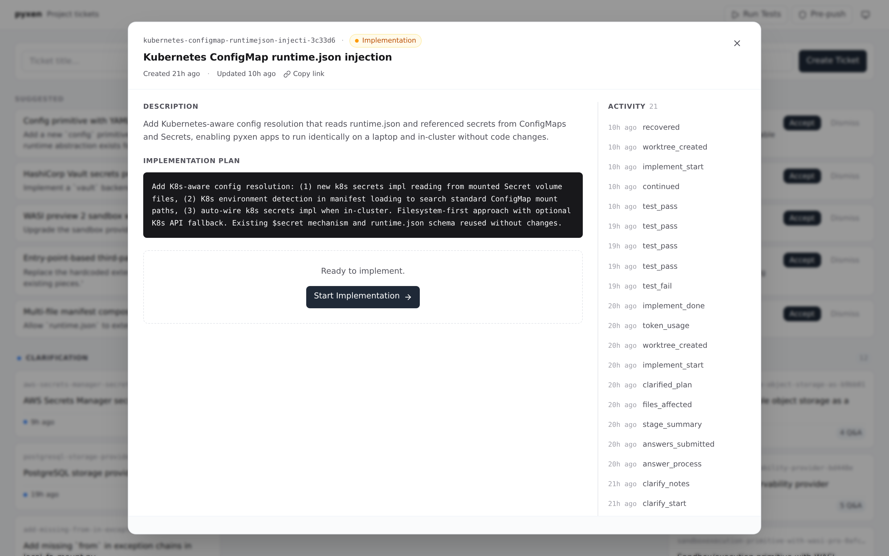
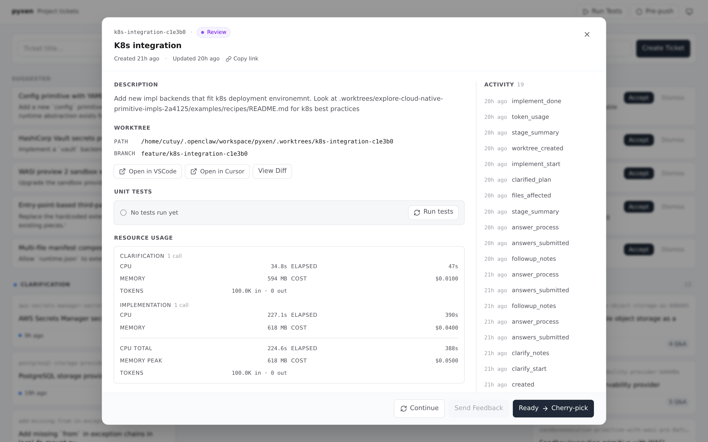
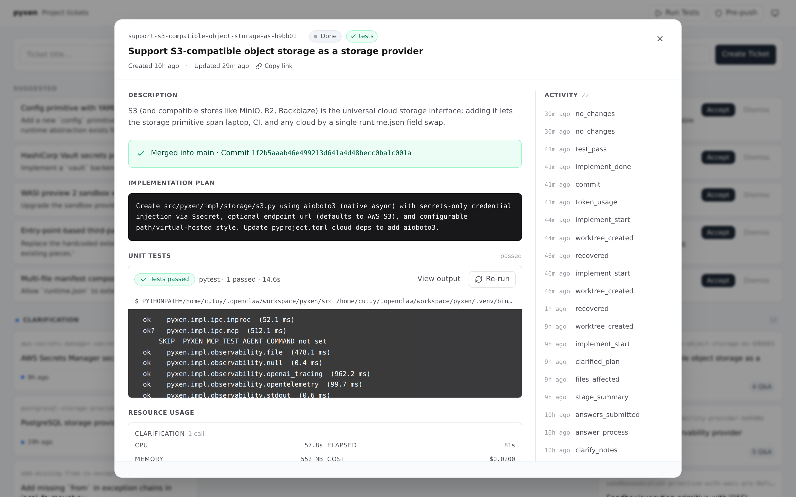
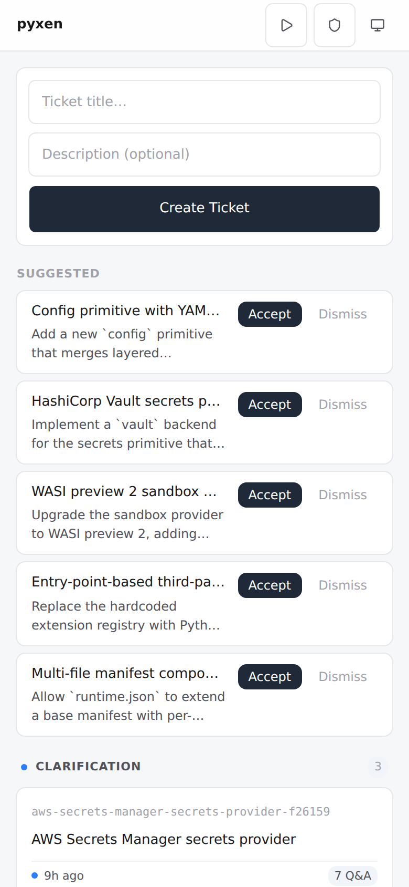
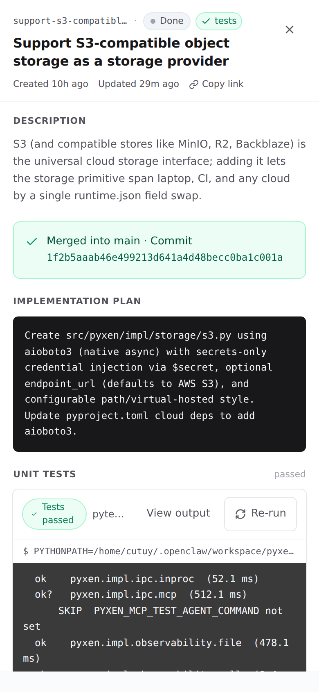

# Jira Dashboard

Lightweight ticket dashboard for AI-assisted development. No DB servers, no cloud accounts.

## Screenshots

The full ticket lifecycle, board to merge — click any card to open the popup.

### Home

The four-stage board with AI-suggested tickets queued above. Create new tickets inline, run tests, trigger a pre-push check from the header.



### Clarification

The dashboard asks focused questions, accepts multiple-choice or free-form answers (including an "Other" escape hatch), and supports multi-round back-and-forth before code is written.



### Implementation

Once answers are in, the AI drafts a plan and commits it to a per-ticket worktree. The same plan becomes the spec the implementation runs against.



### Review

The worktree, branch, and diff are linked straight to your editor (VSCode / Cursor). Per-stage resource usage breaks down CPU, memory, cost, and tokens for the clarification vs. implementation calls so you can spot runaway runs. One click cherry-picks into `main`.



### Done

Merged commit, plan, test report with collapsible output, and the full activity timeline — the ticket's complete history in one view.



### Mobile

Single-column layout, full-screen sheet for ticket detail. Touch-friendly button sizes, the same data, no compromises.

| Home | Ticket |
|:---:|:---:|
|  |  |

## Quick Start

```bash
git clone <this-repo>
cd jira-dashboard
./bootstrap.sh   # interactive — prompts for project path, coder CLI, etc.
```

Opens http://localhost:3006.

## Configuration

| Where | What | Tracked |
|---|---|---|
| `<project>/.jira-dashboard/.env` | Dashboard settings (port, project name, coder bin) | No (`.gitignore` has `*`) |
| `<project>/.env` | Environment for the coder subprocess (API keys, venv) | Usually not |
| `config.json` | Structural defaults (timeouts) | Yes |

### How config loading works

1. Walks up from `cwd` looking for `.jira-dashboard/.env` → that directory becomes `projectDir`
2. Loads `.jira-dashboard/.env` as dashboard settings
3. Loads `<project>/.env` and injects into `process.env` — coder CLI inherits these
4. `config.json` values are fallbacks for everything

## Caveats

- **API keys** go in `<project>/.env` (not `.jira-dashboard/.env`). Only the project root `.env` is passed to the coder child process.
- **Linux only** — resource monitor reads `/proc/<pid>/stat`.
- **Python venv** — `VIRTUAL_ENV` and `.venv/bin/` are prepended automatically.

---

## For Maintainers

```bash
npm test            # run all tests
npm run test:config # config loader only
```

### Pre-push hook

```bash
git config core.hooksPath .githooks
```
