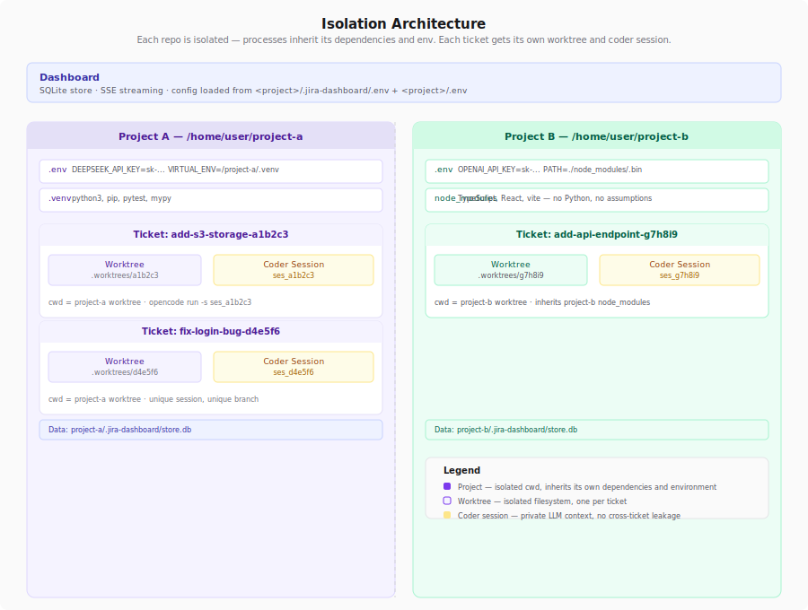

# Jira Dashboard

A kanban board for todo-driven development with AI agents.

Start with ambiguity — a rough idea, a user complaint, a TODO scribbled in a doc.
The agent asks clarifying questions, proposes a plan, implements in an isolated
worktree, and runs tests. You review, give feedback, and close. Human and agent
in the loop, no context switches, no ticket groomers.

## Quick Start

```bash
git clone <this-repo>
cd jira-dashboard
./bootstrap.sh   # interactive — prompts for project path, coder CLI, etc.
```

Opens http://localhost:3006.

## Configuration

| Where | What | Tracked |
|---|---|---|
| `<project>/.jira-dashboard/.env` | Dashboard settings (port, project name, coder bin) | No (`.gitignore` has `*`) |
| `<project>/.env` | Environment for the coder subprocess (API keys, venv) | Usually not |
| `config.json` | Structural defaults (timeouts) | Yes |

## Workflow

The full ticket lifecycle, board to merge — click any card to open the popup.

| Stage | Desktop |
|:---:|:---:|
| Home |  |
| Clarification |  |
| Implementation |  |
| Review |  |
| Done |  |

### Mobile

| Home | Ticket |
|:---:|:---:|
|  |  |

## Advanced usage

```bash
npm test            # run all tests
npm run test:config # config loader only
git config core.hooksPath .githooks # pre-push hook
```

### How config loading works

1. Walks up from `cwd` looking for `.jira-dashboard/.env` → that directory becomes `projectDir`
2. Loads `.jira-dashboard/.env` as dashboard settings
3. Loads `<project>/.env` and injects into `process.env` — coder CLI inherits these
4. `config.json` values are fallbacks for everything

### Caveats

- **API keys** go in `<project>/.env` (not `.jira-dashboard/.env`). Only the project root `.env` is passed to the coder child process.
- **Linux only** — resource monitor reads `/proc/<pid>/stat`.
- **Python venv** — `VIRTUAL_ENV` and `.venv/bin/` are prepended automatically.

### Architecture

