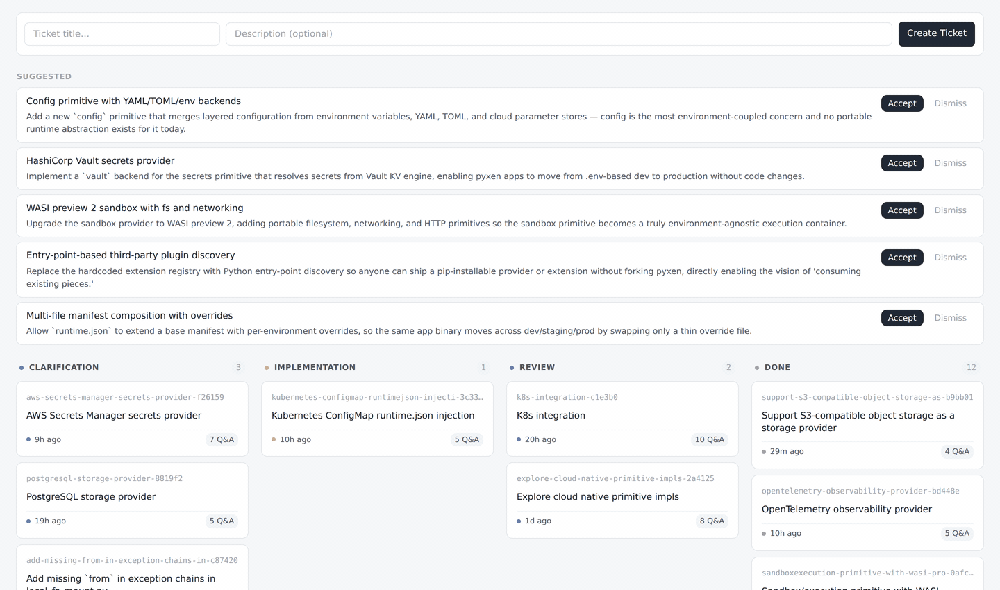
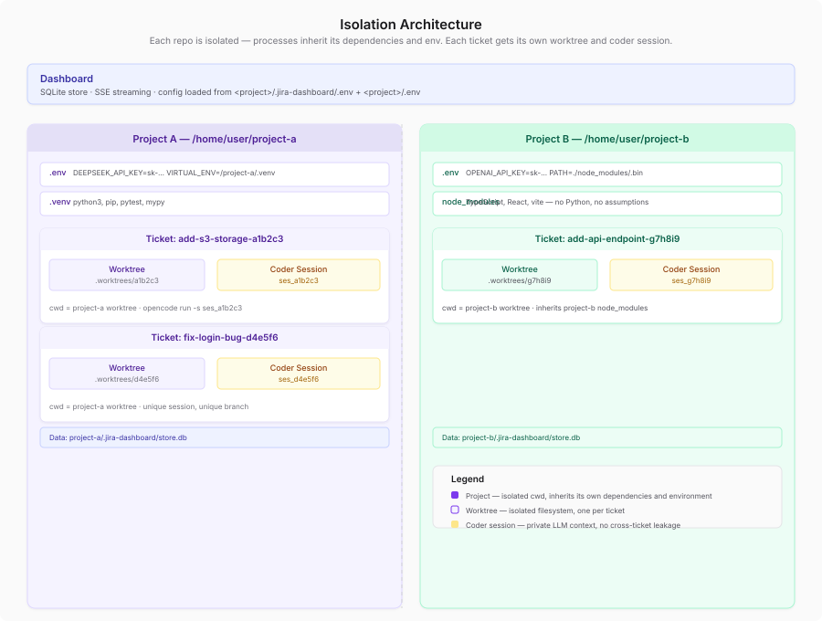
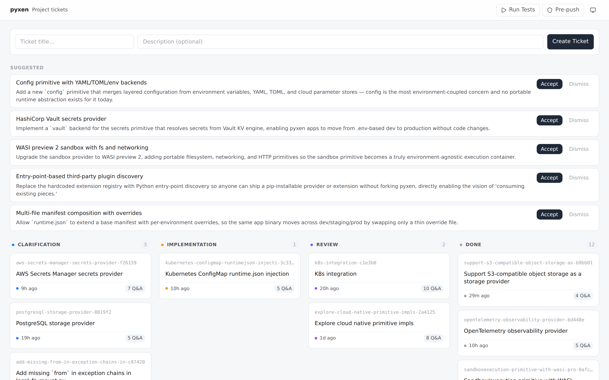
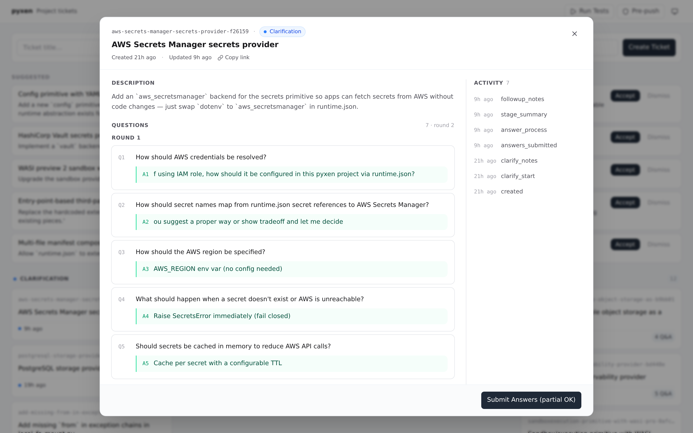
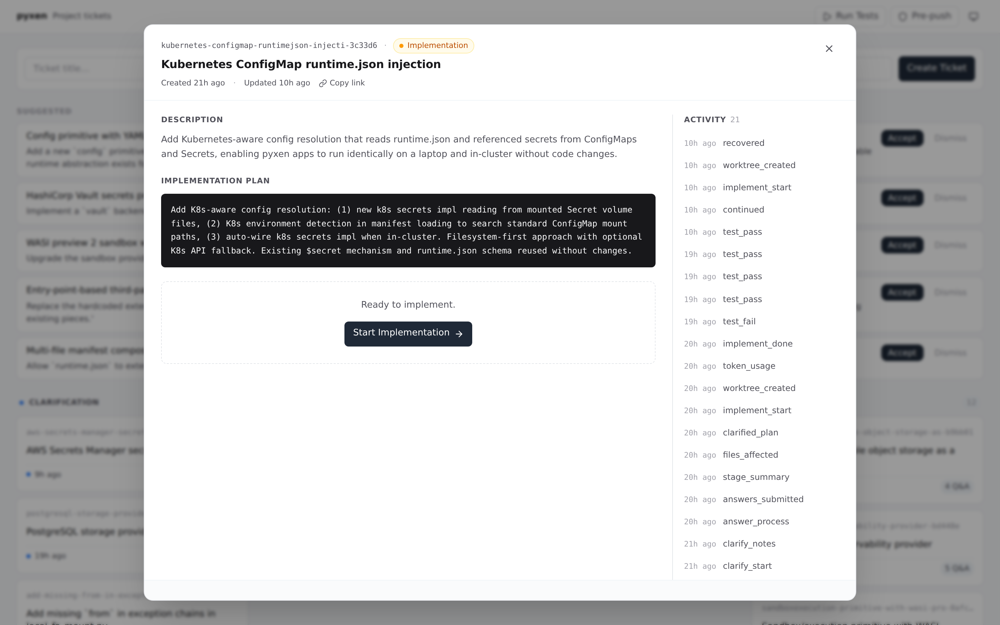
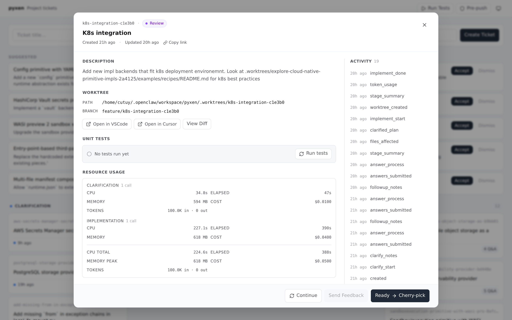
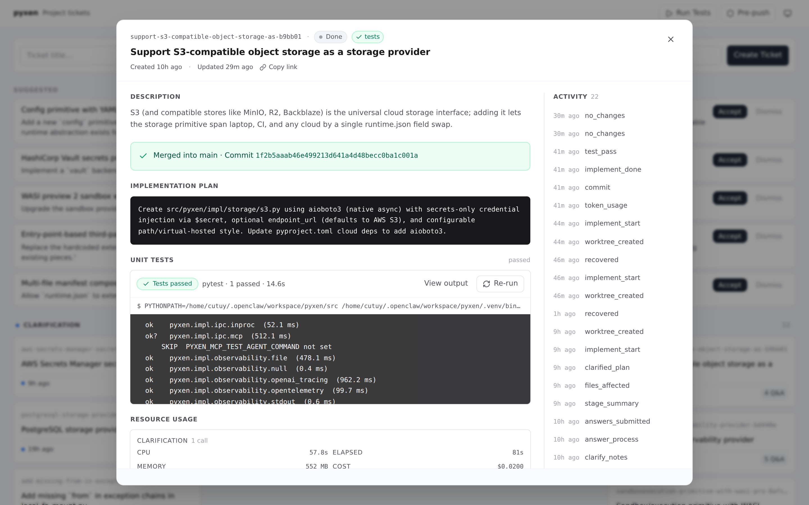
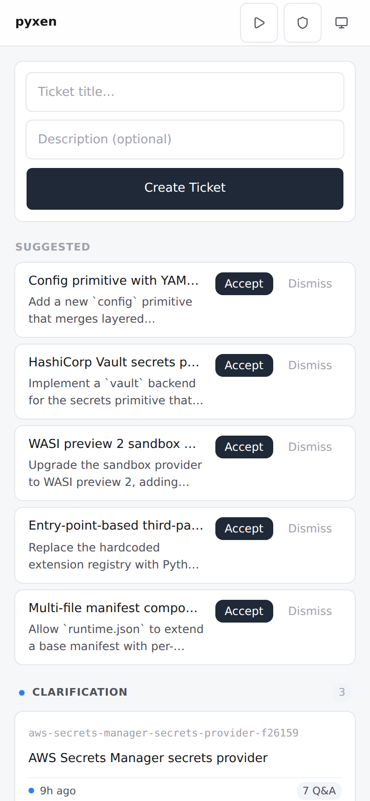
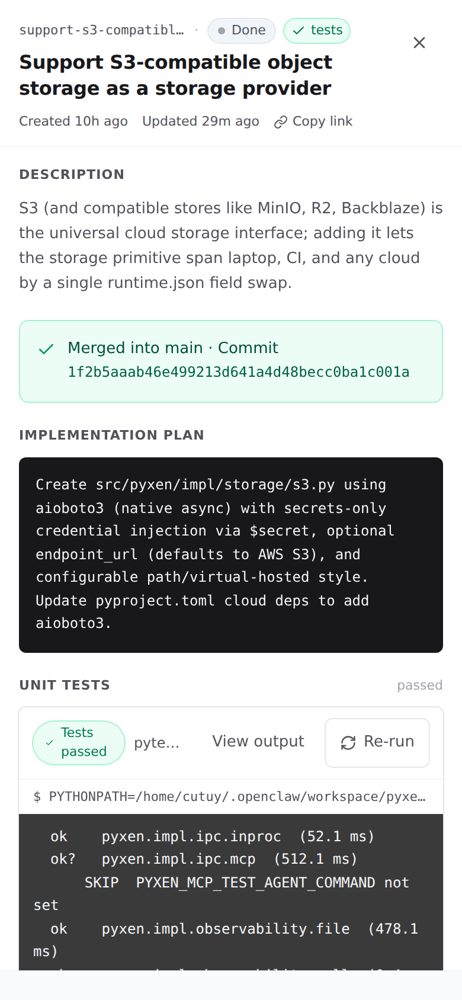

# Jira Dashboard

A local kanban board for working with AI coding agents. Add a task, answer
clarifying questions, and review the agent's changes and test results. Each
task uses a separate Git worktree.





## Quick start

You'll need Git, Node.js 24.18 or later in the 24.x series, npm, and a configured
coding CLI: OpenCode, Claude Code, or Codex.

```bash
git clone https://github.com/Cutuy/jira-dashboard.git
cd jira-dashboard
./bootstrap.sh
```

The setup script asks for your project repository, coding CLI, and port. It
builds the client and installs a background service using systemd on Linux or
launchd on macOS. Open the local URL it prints; the default port is 3006.

To track another project, run setup again with a different port.

## Workflow

Tasks move through backlog, clarification, implementation, and review. You can
follow progress, inspect changes and test output, and leave feedback before
accepting changes or opening a pull request. The board also works on mobile.

| Stage | What happens | Desktop |
| --- | --- | --- |
| Backlog | Add a task. |  |
| Clarification | Answer the agent's questions. |  |
| Implementation | Follow changes in a separate worktree. |  |
| Review | Inspect the diff and test results, then give feedback or accept. |  |
| Done | Accepted changes are applied and the task closes. |  |

| Mobile board | Mobile ticket |
| --- | --- |
|  |  |

## Configuration

| File | Purpose |
| --- | --- |
| `<project>/.jira-dashboard/.env` | Dashboard settings, including the port and coding CLI |
| `<project>/.env` | Environment variables and API keys passed to the coding CLI |
| `config.json` | Defaults for timeouts, worktrees, and test commands |

Set `test.command_override` in `config.json` to use your project's test command.
The default runs Python tests. Keep credentials out of version control.

Adapters for OpenCode, Claude Code, and Codex live in [`coder/`](coder/).
A dummy adapter is available for testing without a coding service.

## Development

```bash
npm ci
npm test
cd client
npm ci
npm test
npm run build
```

See [CONTRIBUTING.md](CONTRIBUTING.md) for contributions,
the [roadmap](docs/todo.md) for planned work, and the
[runbook](docs/sre/runbook.md) for operations.

## License

[MIT](LICENSE)
